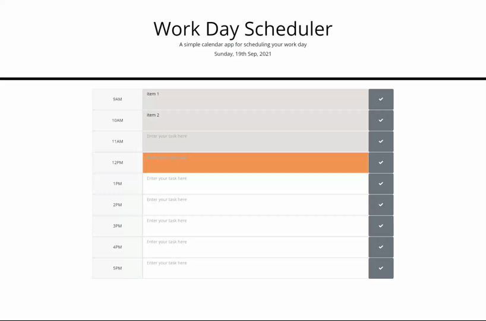

# 📖 Work Day Scheduler!

## 💡 The Tool

This is a work day scheduler which user can input their daily tasks, save and come back later to check. It also highlights the hour of the day by color.

## 💡 The design

* Most required functions are implemented in the JS file 

* I use moment to update the daily time in the title, and use a for loop to draw each row using a given time and task object of an array

* when the page loads, it stores the object array from local storage if it exists

* When it draws each row, it checks the time of that row and the current time. It gives the row a color depedning on if it's in the past, present, or future.

* Event listeners are added to both the testarea and the save button. If there's a key pressed and if it's not enter, it will updatae the save button icon to indicate the user they need to save the text. If it's an enter, it saves. If the save button is clicked, it saves.

## 💡 Links

* Please go to [LINK]( https://shaotangyen.github.io/work-day-scheduler) to check out the final page.

* Or [Link](https://github.com/shaotangyen/work-day-scheduler) to go to GitHub page.

## 💡 Screenshots

The following animation demonstrates the Work Day Scheduler:

---

© 2021 Made by Shao
